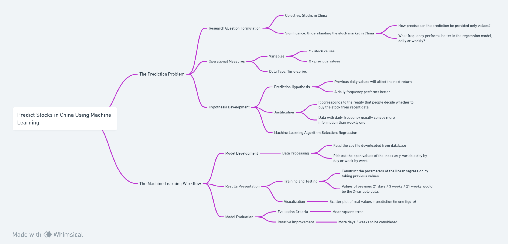

# Predict Stocks in China Using Machine Learning
## The Prediction Problem
This research aims to predict stocks in China that are probably different from those in the USA such as the S&P 500. This project can provide a brief understanding of the stock market in China since it is widely regarded as "unpredictable". The research problem would be as follows:

RQ1: How precisely can the prediction be provided only values?

RQ2: What frequency performs better in the regression model, daily or weekly?

The data is in type of time series, with stock values as y variable and values of previous time as X variables. It is hypothesized that previous values will affect the next return, and the data of daily frequency will perform better. This hypothesis corresponds to the reality that people decide whether to buy the stock from recent data and concerns that data with daily frequency usually convey more information than weekly ones. Regression is adopted as a machine learning algorithm in this project.

## The Machine Learning Workflow
During the data processing, data in the form of CSV files are downloaded from the database and read by python. Then the open values of the index are chosen and collected as y variable day by day or week by week. To construct the parameters of the linear regression, values of the previous 21 days / 3 weeks / 21 weeks would be considered as X variables.

A scatter plot of real values together with a linear plot of prediction will be presented in one figure to test the result visually. In addition, the mean square error is calculated for quantitative evaluation. More days/weeks of x scale may be considered to improve iteratively.

